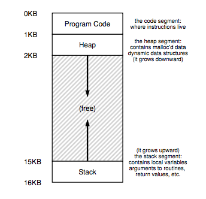

# Ch. 13: The Abstraction: Address Spaces

### 13.2: Multiprogramming and Time Sharing

Best to leave processes in memory while switching between them, allowing the OS to implement time sharing efficiently

_Address Space_: easy to use abstraction of physical memory; the running program's view of memory in the system

  - Contains all of the memory sate of the running program
  - Stack keeps track of where it is in the function call chain, along with allocating local variables and passing parameters and return values to and from routines
  - Heap used for dynamically-allocated, user-managed memory
  - Code

OS is virtualizing memory - the running program thinks it is loaded into memory at a particular address (say 0) and has a potentially very large address space (say 32-bits or 64-bits)

### 13.4: Goals

Transparency: OS should implement virtual memory in a way that's invisible to the running program

Efficiency: OS should strive to make the virtualization as efficient as possible, both in time and space

Protection: OS should protect processes from one another as well as the OS itself from processes. Delivers the property of isolation among processes; each process should be running in its own isolated cocoon.
