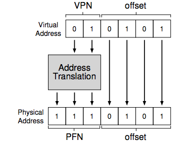

# Ch. 18: Paging: Introduction

Divide process' address space into fixed-sized units, each of which we call a _page_.

We view physical memory as an array of fixed-sized slots called _page frames_: each of which can contain a single virtual-memory page

### 18.1: Simple Example and Overview

Paging provides flexibility: with a fully-developed paging approach, we can support the abstraction of an address-space completely; leaving the process to use its address space however it wishes.

Simplicity: OS simply finds number of free pages requested

_Page Table_: Stores address translations for each of the virtual pages of the address space. Note this is a per-process data structure.

##### Translation

Virtual address has: virtual page number (VPN), and offset w/in page.



### 18.2: Where Are Page Tables Stored?

Assume for now that page table lives in physical memory that the OS manages.

### 18.3: What's Actually in the Page Table?

For now assume we're using the _linear page table_ data structure to store the mappings. OS indexes the array by virtual page number.

Each PTE contains:
  - valid bit: all unused space between stack/heap is marked invalid
  - protection bits: indicating permissions
  - present bit: indicates whether in physical memory or on disk
  - dirty bit: whether page has been modified since it was brought into memory
  - reference bit: track whether pages has been accessed, tracks which pages are popular

### 18.4: Paging: Also Too Slow

Assume _page-table base register_ contains the physical address of the starting location of the page table.

```
VPN = (VirtualAddress & VPN_MASK) >> SHIFT
PTEAddr = PageTableBaseRegister + (VPN * sizeof(PTE))
```

```
offset = VirtualAddress & OFFSET_MASK
PhysAddr = (PFN << SHIFT) | offset
```

For every memory reference, paging requires us to perform one extra memory reference in order to first fetch the translation from the page table

### 18.5: A Memory Trace
