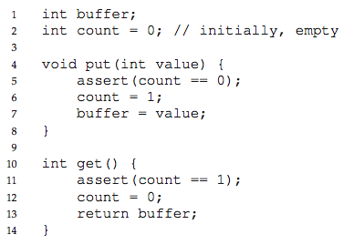

# Ch. 30: Condition Variables

### 30.1: Definition and Routines

*Condition Variable*: is an explicit queue that threads can put themselves on when some state of execution (i.e., some condition) is not as desired (by waiting on the condition); some other thread, when it changes said state, can then wake one (or more) of those waiting threads and thus allow them to continue (by signaling on the condition)

Have two operation associated with it:
```
pthread_cond_wait(pthread_cond_t *c, pthread_mutex_t *m);
pthread_cond_signal(pthread_cond_t *c);
```

Wait assumes mutux is locked when called - wait releases the lock and puts the calling thread to sleep

Tip: Should always hold the lock while signaling

### 30.2: The Producer/Consumer (Bounded Buffer) Problem

Producers generate data items and place them in a buffer; consumers grab said items from the buffer and consume them in some way

Used in http servers, piping output of one program into another



#### A Broken Solution

With multiple threads, we have two problems.

- Signaling a thread only wakes them up; it is a hint that the state of the world has changed, but no guarantee that this state will still be as desired

*Mesa Semantics*: interpretation of what a signal means (used in almost all systems) - always use while loops

*Hoare Semantics*: provides stronger guarantee that the woken thread will run immediately upon being woken

#### Single Buffer Producer/Consumer Solution

use two condition variables, empty, and fill

#### Final Producer/Consumer Solution

Add more buffers...

### 30.3: Covering Conditions

`pthread cond broadcast()`, which wakes up all waiting threads

*Covering Condition*: covers all the cases where a thread needs to wake up 
