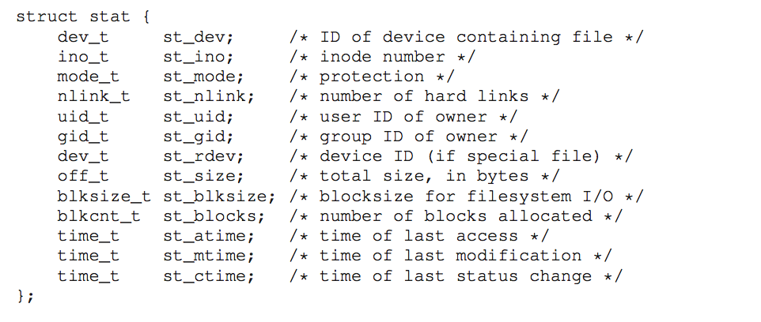

# Ch. 39: Files and Directories

## 39.1 Files and Directories

*inode number*: Low-level name of a file, assume each file has an inode number associated with it.

Directory has inode number as well. Its contains a list of user-readable name->low-level name mappings

## 39.3 Creating Files

`int fd = open("foo", O_CREAT|O_WRONLY|O_TRUNC, S_IRUSR|S_IWUSR);`
  - returns *file descriptor*: simply integer, called a *capability* (an opaque handle that gives you the power to perform certain operations)

## 39.4 Reading and Writing Files

Each running process already has three files open
  - standard input (which the process can read to receive input)
  - standard output (which the process can write to in order to dump information to the screen)
  - standard error (which the process can write error messages to). These are represented by file descriptors 0, 1, and 2, respectively.
Thus, when you first open another file (as cat does above), it will almost certainly be file descriptor 3.

# 39.5 Reading and Writing, But Not Sequentially

`off_t lseek(int fildes, off_t offset, int whence);`

If whence is SEEK_SET, the offset is set to offset bytes.
If whence is SEEK_CUR, the offset is set to its current
location plus offset bytes.
If whence is SEEK_END, the offset is set to the size of
the file plus offset bytes.

Open files have current offsets, which is updated when a read or write of N bytes takes place, or explicitly with _lseek_

## 39.6 Writing Immediately with `fsyc()`

Normally when a program calls `write()`, it's just written to a buffer that's later written to persistent storage

`fsync(int fd)` forces all dirty data to disk

## 39.7 Renaming Files

`rename(char *old, char *new)`

Atomic!

Atomic file updating is achieved by writing out a new version of the file `foo.txt.tmp`, forcing it to disk w/ `fsync`, and then renaming the temp file to the original file's name once the OS is sure the file's on disk.

## 39.8 Getting Information About Files

To see the metadata for a certain file, we can use the `stat()` or `fstat()` system calls



## 39.9 Removing Files

`unlink(char[] fileName)`

## 39.10 Making Directories

`mkdir()`

When a directory is created, it has two entries '.' that refers to itself, and '..' that refers to its parent

## 39.11 Reading Directories

```
int main(int argc, char *argv[]) {
    DIR *dp = opendir(".");
    assert(dp != NULL);
    struct dirent *d;
    while ((d = readdir(dp)) != NULL) {
        printf("%d %s\n", (int) d->d_ino, d->d_name);
    }
    closedir(dp);
    return 0;
}
```

## 39.12 Deleting Directories

`rmdir()`

Requires that the directory is empty

## 39.13 Hard Links

Link simply creates another name in the directory you are creating the link to, and it refers it to the same inode number of the original file

When you create a file, you're doing two things:
- making inode structure
- linking human-readable name to that file, and putting that link into a directory

When fs unlinks file, it checks reference count w/in inode number.

## 39.14 Symbolic Links

Hard links don't allow links to directory, or linking to files w/in other disk partitions

Simply holds the pathname of the linked-to-file as the data of the link file

## 39.15 Making and Mounting a File System

`mkfs` takes a device, a file system type, as input and simply writes and an empty file system

This file system then needs to be mounted (`mount()`: takes an existing directory as a mount point)
