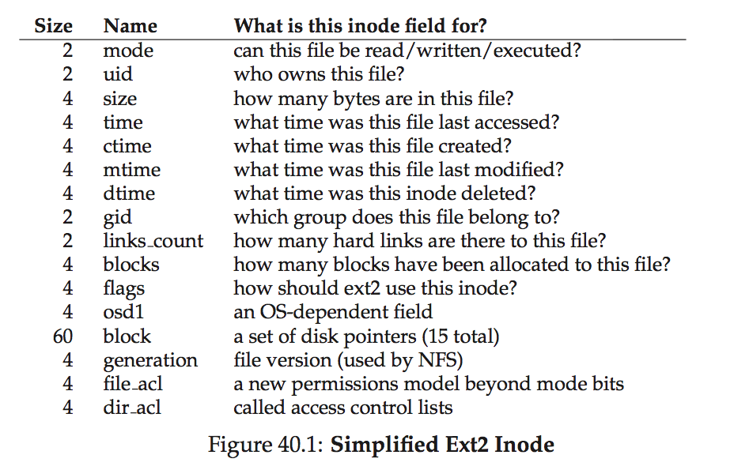
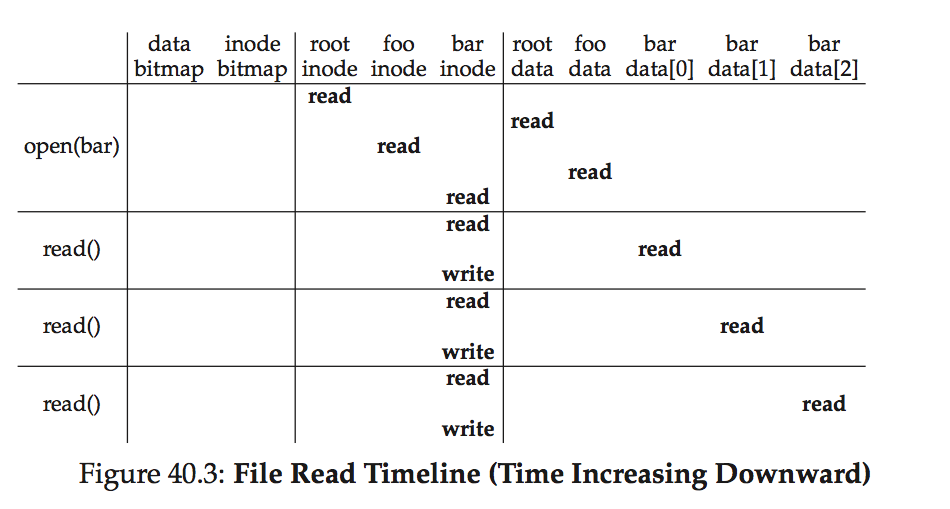
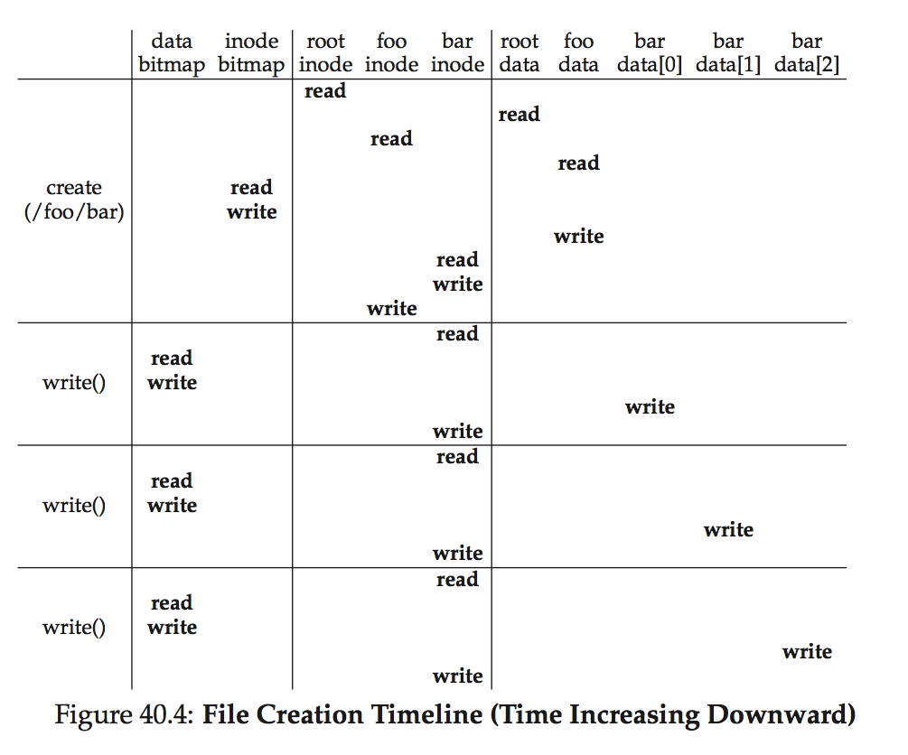

# Ch. 40: File System Implementation

## 40.1 The Way to Think

Data structures
Access Methods

## 40.2 Overall Organization

Disk is split into blocks
Space reserved for inodes, called inode table
Allocation structures track whether inodes or data blocks are free or allocated
  - use bitmap: one for data region, and one for the inode table

The first block, superblock, contains information about this particular file system

## 40.3 File Organization: The Inode

Short for index node

Sector address `iaddr` of the inode block can be calculated as follows:
```
blk = (inumber * sizeof(inode_t)) / blockSize;
sector = ((blk * blockSize) + inodeStartAddr) / sectorSize;
```



### The Multi-level Index

*Indirect pointer*: points to a block that contains more pointers, each of which points to user data

To support larger files, add another pointer to the inode: the double indirect pointer
  - Refers to a block that contains pointers to indirect blocks, each of which contain pointers to data blocks

Overall, this imbalanced tree is referred to as the *multi-level index approach* to pointing to file blocks.

## 40.4 Directory Organization

## 40.5 Free Space Management

Uses two simple bitmaps. pre-allocation policy guarantees portion of the file will be contiguous on the disk

## 40.6 Access Paths: Reading and Writing

### Reading A File From Disk

To read, first fs needs to find inode.

Root inode is usually #2 in more Unix file systems.



### Writing A File To Disk

each write to a file logically generates five I/Os:
  - one to read the data bitmap (which is then updated to mark the newly-allocated block as used)
  - one to write the bitmap (to reflect its new state to disk)
  - two more to read and then write the inode (which is updated with the new block’s location)
  - finally one to write the actual block itself.



## 40.7 Caching and Buffering
