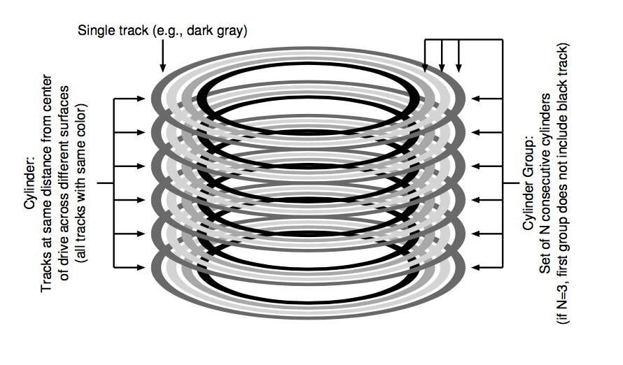

# Ch. 41: Locality and the Fast File System

## 41.1 The Problem: Poor Performance

The main issue was that the old UNIX file system treated the disk like it was a random-access memory

The file system would end up getting quite fragmented, as the free space was not carefully managed

The original block size was too small (512 bytes)

## 41.2 FFS: Disk Awareness is the Solution

Fast File System (FFS): designed the file system structures and allocation policies to be “disk aware”

Changed implementations of open, read, write, etc

## 41.3 Organizing Structure: The Cylinder Group



By placing two files within the same group, FFS can ensure that accessing one after the other will not result in long seeks across the disk.

FFS includes all the structures you might expect a file system to have within each group

## 41.4 Policies: How to Allocate Files and Directories

"keep related stuff together (and its corollary, keep unrelated stuff far apart)"

Placement of directories: find the cylinder group with a low number of allocated direc- tories (to balance directories across groups) and a high number of free inodes (to subsequently be able to allocate a bunch of files), and put the directory data and inode in that group

Placement of files: First, it makes sure (in the general case) to allocate the data blocks of a file in the same group as its inode, thus preventing long seeks between inode and data (as in the old file system). Second, it places all files that are in the same directory in the cylinder group of the directory they are in

## 41.5 Measuring File Locality

Our distance metric, in other words, measures how far up the directory tree you have to travel to find the common ancestor of two files; the closer they are in the tree, the lower the metric.

## 41.6 The Large-File Exception

After some number of blocks are allocated into the first block group (e.g., 12 blocks, or the num- ber of direct pointers available within an inode), FFS places the next “large” chunk of the file (e.g., those pointed to by the first indirect block) in an- other block group (perhaps chosen for its low utilization). Then, the next chunk of the file is placed in yet another different block group, and so on

Without large-file exception:
```
group inodes     data
    0 /a-------- /aaaaaaaaa aaaaaaaaaa aaaaaaaaaa a---------
    1 ---------- ---------- ---------- ---------- ----------
    2 ---------- ---------- ---------- ---------- ----------
    ...
```

With:
```
group inodes     data
    0 /a-------- /aaaaa---- ---------- ---------- ----------
    1 ---------- aaaaa----- ---------- ---------- ----------
    2 ---------- aaaaa----- ---------- ---------- ----------
    3 ---------- aaaaa----- ---------- ---------- ----------
    4 ---------- aaaaa----- ---------- ---------- ----------
    5 ---------- aaaaa----- ---------- ---------- ----------
    6 ---------- ---------- ---------- ---------- ----------
    ...
```

^ Spreading blocks like this can hurt performance, especially sequential file access.
  - amortization used in that if chunk size is large enough, the file system will spend most of its time transferring data from disk and little time between seeking between chunks of the block

FFS didn't use technique above: Instead, the first twelve direct blocks were placed in the same group as the inode; each subsequent indirect block, and all the blocks it pointed to, was placed in a different group

## 41.7 A Few Other Things About FFS

As most files were small at the time, used *sub-block*, which were 512-byte little blocks

*Parameterization*: FFS would figure out specific performance parameters of the disk and use those to decide on the staggered layout scheme

Also allowed for long file names (new from the otherwise standard 8 character fixed size)

Introduced sym links
