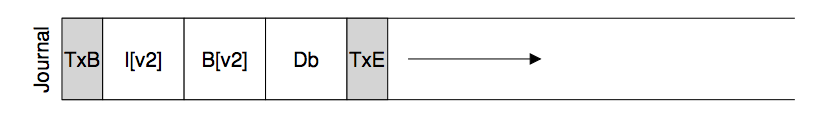

# Ch. 42 Crash Consistency: FSCK and Journaling

*Crash-consistency problem*: Writing to two on-disk structures - If the system crashes or loses power after one write completes, the on-disk structure will be left in an inconsistent state

## 42.1 A Detailed Example

### Crash Scenarios

Need to perform three writes, imagine that a single write succeeds:
- Just the data block is written to disk
  - Data on the disk but no inode that points to it and no bitmap that says the block is allocated
  - Not a problem in terms of consistency
- Just the updated inode is written to disk
  - inode points to disk address that hasn't been written yet.
  - File-system inconsistency: on-disk bitmap tells us that data block 5 hasn't been allocated, but the inode says it has
- Just the updated bitmap is written to the disk
  - inconsistent again, could result in space leak as block 5 wouldn't be used by file system

Also have cases where two writes succeed.

## 42.2 Solution #1: The File System Checker

Basically, they decided to let inconsistencies happen and then fix them later (when rebooting). A classic example of this lazy approach is found in a tool that does this: `fsck`

Can't fix garbage data issue

Phases:
  - Runs before file system is mounted and made available
  - Superblock: sanity checks, attempts to find suspect superblock
  - Free blocks: scans inodes, indirect blocks, double indirect blocks, to build understanding of which blocks are allocated w/in the file system
    - Uses this to build a correct version of allocation bitmaps
  - Inode state: e/ is checked for corruption or other problems
  - Inode links: verifies link count
  - Duplicates: checks for duplicate pointers to the same block
  - Bad blocks: bad if obviously points to something outside of its valid range
  - Directory checks: assures that '.', '..' are first entries, that each inode referred to in a directory entry is allocated, and ensuring that no directory is linked to more than once in the entire hierarchy

Expensive! Takes loads of time to fix simple three block problems.

## 42.3 Solution #2: Journaling (Or Write-Ahead Logging)

Write-ahead logging (journaling): When updating the disk, before over- writing the structures in place, first write down a little note (somewhere else on the disk, in a well-known location) describing what you are about to do. Writing this note is the “write ahead” part, and we write it to a structure that we organize as a “log”

Adds a bit of work during updates but greatly reduces amount of work required in recovery

Journal is placed w/in same file system image

### Data Journaling

The transaction begin (TxB) tells us about this update, including information about the pending update to the file system (e.g., the final addresses of the blocks I[v2], B[v2], and Db), as well as some kind of transaction identifier (TID).
The middle three blocks just contain the exact contents of the blocks themselves

*Checkpointing*: bring it up to date w/ the pending update in the journal)

To assure that no issues occur when writing journal, file system issues transactional write
  - Journal write: Writes all blocks except the TxE block to the journal, issuing these writes all at once
  - Journal commit: When these writes complete, TxE is then written, leaving the journal in its final, safe state.

### Recovery

If the crash happens after the transaction has committed to the log, but before the checkpoint is complete, the file system can recover the update as follows:
  - replays transactions (redo logging)

### Batching Log Updates

Usually, instead of multiple updates, one can buffer all updates into a global transaction
  - marks in-memory inode bitmap, inodes of the files, dir data, directory inode as dirty, and adds them to the list of blocks that form the current transaction
  - After timeout of X seconds, this single global transaction is committed

### Making the Log Finite

As so the log doesn't fill, journaling file systems treat the log as a circular data structure

Must take action some time after a checkpoint to free the log space

### Metadata Journaling

For each write to disk, we are now also writing to the journal first, thus doubling write traffic

^ data journaling

*Ordered Journaling*: same as data, except user data is not written to the journal
  - Data block written to file system proper (disk)
  - Data write performed first

### Tricky Case: Block Reuse

Issues arise when deleting - linux ext3 adds a new type of record to the journal (revoke).

Deleting a file/directory will cause a revoke record to be written to the journal. When rewriting the journal, the system then first scans for such revoke records (as to not replay them)

## 42.4 Solution #3: Other Approaches

_Soft Updates_: carefully orders all writes to the file system to ensure that the on-disk structures are never left in an inconsistent state

_COW (Copy on write)_: This technique never overwrites files or directories in place; rather, it places new updates to previously unused locations on disk. After a number of updates are completed, COW file systems flip the root structure of the file system to include pointers to the newly updated structures

_backpointer-based consistency_: no ordering enforced between writes, backpointer added to every block in the system
