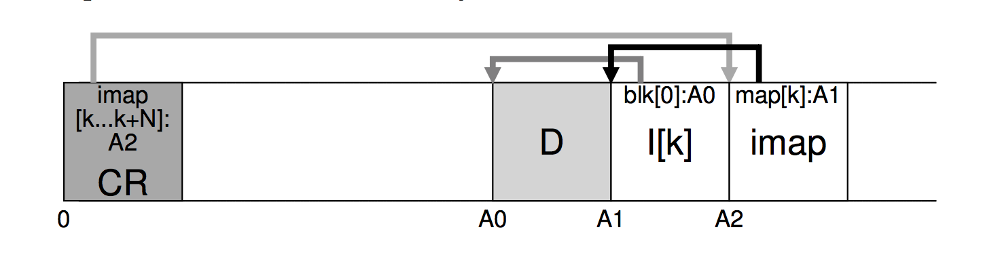

# Ch. 43 Log-Structured File Systems

LFS: Log-structured File System: When writing to disk, LFS first buffers all updates (including metadata) in an in-memory segement; when the segment is full, it is written to disk in one long sequential transfer to an unused part of the disk.

### 43.1 Writing to Disk Sequentially

### 43.2 Writing Sequentially and Effectively

Simply writing to disk in sequential order is not enough to achieve peak performance; rather, you must issue a large number of contiguous writes (or one large write) to the drive in order to achieve good write performance

*Write buffering*: Before writing to the disk, LFS keeps track of updates in memory; when it has received a sufficient number of updates, it writes them to disk all at once, thus ensuring efficient use of the disk

Large chunk of updates LFS writes at one time is reffered to by the name of a segment

### 43.3 How Much to Buffer?

Depends on the disk itself, specifically how high the positioning overhead is in comparison to the transfer rate

(See pdf for formulas/examples)

### 43.4 Problem: Finding Inodes

In a typical file system such as FFS, or even the old UNIX file system, finding inodes is easy, because they are organized in an array and placed on disk at fixed locations.

### 43.5 Solution Through Indirection: The Inode Map

_Level of indirection_ between inode numbers and the inodes through a data structure called the inode map

Needs to be kept persistent, LFS places chunks of the inode map right next to where it is writing all of the other new information

#### Completing the Solution: The Checkpoint Region

*check-point region (CR)*: Fixed and known location, contains pointers to the latest pieces of the inode map
  - Only updated periodically



### 43.7 Reading a File From Disk: A Recap

### 43.8 What About Directories?

Handled the same as in typical Unix systems, except first look for dir inode in inode map

Solves the _recursive update problem_: whenever an inode is updated, its location on disk changes. If we hadn’t been careful, this would have also entailed an update to the directory that points to this file, which then would have mandated a change to the parent of that directory, and so on, all the way up the file system tree.
  - LFS cleverly avoids this problem with the inode map. Even though the location of an inode may change, the change is never reflected in the directory itself; rather, the imap structure is updated while the directory holds the same name-to-inumber mapping

### 43.9 A New Problem: Garbage Collection

Periodically, the LFS cleaner reads in a number of old (partially-used) segments, determines which blocks are live within these segments, and then write out a new set of segments with just the live blocks within them, freeing up the old ones for writing

### 43.10 Determining Block Liveness

*Segment Summary Block*: LFS adds a little extra information to each segment that describes each block: including:
  - inode number
  - offset

```c
(N, T) = SegmentSummary[A];
inode  = Read(imap[N]);
if (inode[T] == A)
    // block D is alive
else
    // block D is garbage
```

### 43.11 A Policy Question: Which Blocks to Clean, and When?

When to clean: either periodically, during idle time, or when you have to because the disk is full

What to clean: Hot, cold segments. Hot being more volatile, cold being stable. Should clean cold first.

### 43.13 Summary

LFS introduces a new approach to updating the disk. Instead of over- writing files in places, LFS always writes to an unused portion of the disk, and then later reclaims that old space through cleaning. This ap- proach, which in database systems is called shadow paging [L77] and in file-system-speak is sometimes called copy-on-write, enables highly effi- cient writing, as LFS can gather all updates into an in-memory segment and then write them out together sequentially
