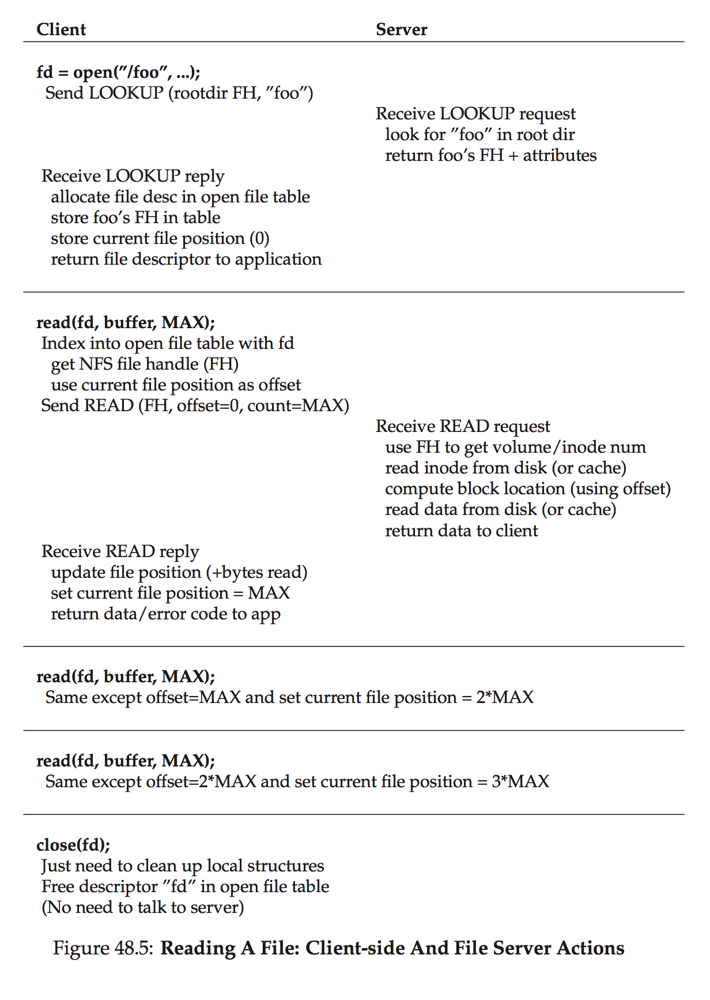

# Ch. 48 Sun's Network File System (NFS)

### 48.1 A Basic Distributed File System

On the client side, there are client applications which access files and directories through the client- side file system. A client application issues system calls to the client-side file system (such as open(), read(), write(), close(), mkdir(), etc.) in order to access files which are stored on the server

On client `read()`, client-side file system sends message to server-side file system, to read a particular block
  - Will receive response from server, copy data into the user buffer supplied to the read call
  - Likely caches the data in memory or even on disk

### 48.3 Focus: Simple and Fast Server Crash Recovery

In NFSv2, the main goal in the design of the protocol was simple and fast server crash recovery

### 48.4 Key to Fast Crash Recovery: Statelessness

### 48.5 The NFSv2 Protocol

*File handle*: used to uniquely describe the file or directory a particular operation is going to operate upon
  - volume identifier: informs server which file system the request refers to
  - inode number: tells server which file w/in that partition the request is accessing
  - generation number: needed when reusing an inode number
    - incremented whenever inode number is reused, allows server to ensure that a client with an old file handle can't accidently access the newly alloc'd file

LOOKUP protocol message is used to obtain a file handle, which is then subsequently used to access file data

### 48.6 From Protocol to Distributed File System

### 48.7 Handling Server Failure with Idempotent Operations

When client doesn't receive response, simply retries the request.
  - this works because most NFS requests are _idempotent_

WRITE, LOOKUP, and READ are all idempotent NFS operations

### 48.8 Improving Performance: Client-side Caching

### 48.9 The Cache Consistency Problem

*Update visibility*: When do updates from one client become visible at other clients?
  - _flush-on-close_: when a file is written to and subsequently closed by a client application, the client flushes all updates to the server

*Stale cache*: to address this problem, NFSv2 clients first check to see whether a file has changed before using its cached content
  - GETATTR, is time-of-modification is more recent than time that the file was fetch into the client cache - client invalidates the file.

### 48.10 Assessing NFS Cache Consistency

### 48.11 Implications on Server-Side Write Buffering
