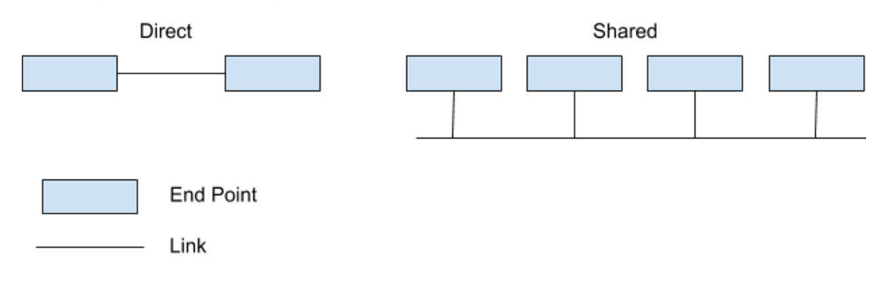
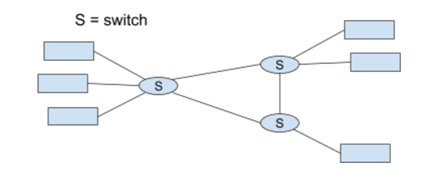
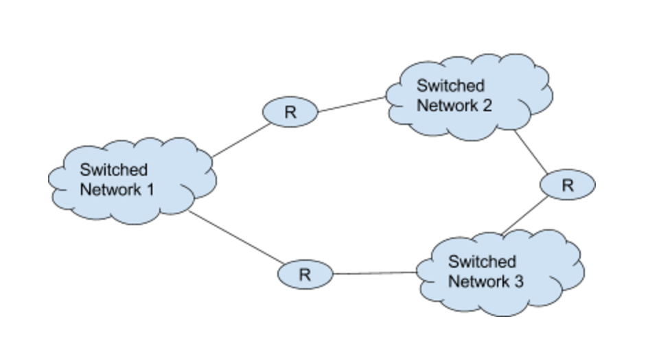
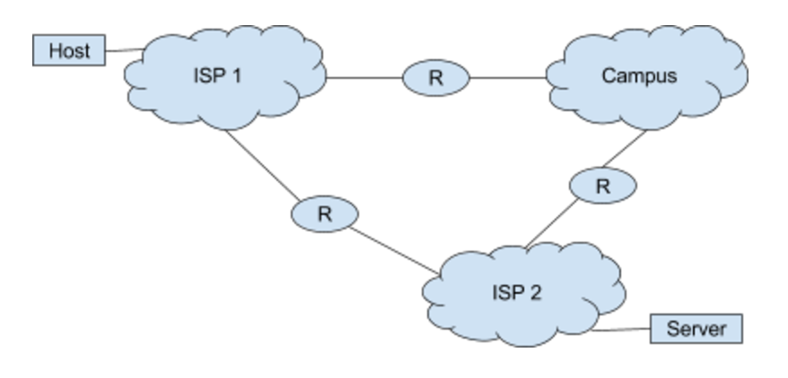

# Lecture 1 Notes (_1.17.17_)

Unicast: two ends
Multicast: one -> many

## Introduction -- users, applications, network

Mostly interact with network in the form of “users”.

Interact using “networked applications” or simply “applications” for this class - email, skype, FB, Browser, mobile apps.

Applications “run” over the network. That is, applications work by communicating with each other over the network. More on this below.

## Applications and their impact on Networks

Applications use the network to send and receive messages.

#### Most popular application: World Wide Web, accessed using a browser
- http://www.cs.wisc.edu/~akella/index.html → Uniform Resource Locator (URL) that locates objects on the Web
- www.cs.wisc.edu → host or machine that serves the page
- ~akella/index.html → identifies the particular page

In retrieving this page, many messages are exchanged
- Retrieving an address for the host -- 128.105.7.31
- Set up a connection to the host
- Request object
- Receive object
- ...\

Most of these objects are sent/received between your browser and a Web server running at 128.105.7.31

Others:
#### On-demand Streaming audio/video
Once delivery of content starts, we want “glitch-free” experience

Different from WWW, where data is not consumed in a “continuous” manner

Delivery start can be delayed but not too much

#### Real-time video/audio -- VoIP, telesurgery
Tight timing constraints -- e.g., when someone speaks at one end, want that heard at the other end near simultaneously

## Design requirements

There are three fundamental requirements:
- Scalable Connectivity: Internet grows in the number of machines it connects every day. How do we connect them all?
- Cost-efficient resource use: When multiple sets of machines want communicate over the Internet, how do we ensure sharing of network resources (e.g., network capacity)? Key is to ensure they share in a manner that the network is used efficiently. E.g., having each pair of machines go at once, followed by another pair, is inefficient.
- Support for common services: Many applications may need the same set of mechanisms to enable their communication. This requirement is about extracting out the common requirements and making them available for many applications to use. Easy to write applications—provide common building blocks.

#### Requirement 1: Toward scalable connectivity

Networks:
1. Directly/shared connectivity

2. Switched network

Two types of switched networks -- circuit-switched (e.g., the good old telephone system), and packet-switched (the Internet).
- We will look at the distinction, and why the Internet is packet switched, in the next lecture. It is tied to the second requirement -- cost-effective resource sharing.

##### Internetwork: stitching together of switched networks

e.g. ISP, Campus, access provider network

4. The entire Internet: recursively grouped

