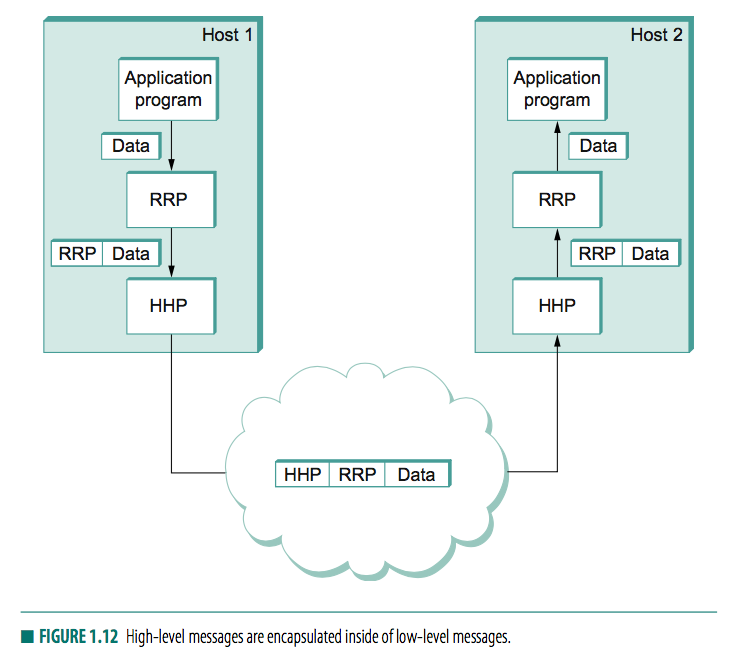
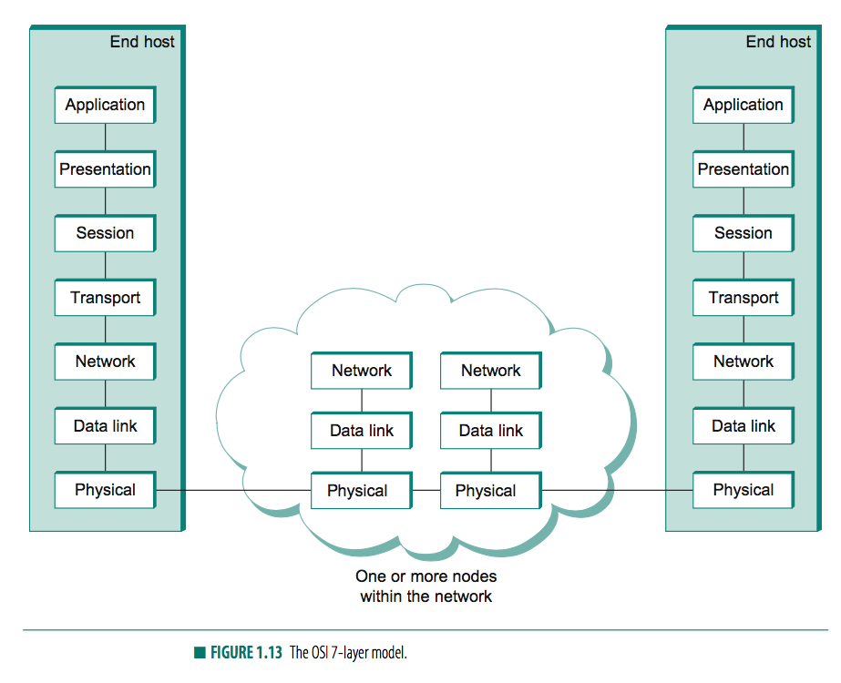
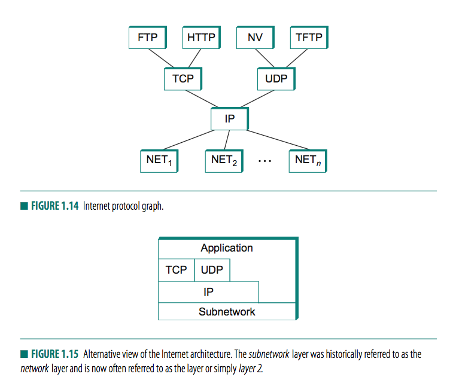

# Chapter 1

## 1.2

### 1.2.2: Scalable Connectivity

link: physical medium
nodes: computers a link connects (sometimes specialized piece of hardware)

#### Circuit-switched network
  - first establishes a dedicated circuit across a sequence of links and then allows the source node to send a stream of bits across this circuit to a destination node.
  - Nodes (switches) on the inside implement the network, nodes on the outside use the network (hosts)

#### Packet-switched network
  - a set of independent networks (clouds) are interconnected to form an internetwork
  - Store-and-forward: strategy used by packet-switched networks, each node first receives a complete packet over some link, stores the packet in its internal memory, and then forwards the complete packet to the next node.

Routing: The process of determining systematically how to forward messages toward the destination node based on its address.

### 1.2.3: Cost-Effective Resource Sharing

Multiplexing methods:
  - Synchronous time-division multiplexing (STDM): The idea of STDM is to divide time into equal-sized quanta and, in a round-robin fashion, give each flow a chance to send its data over the physical link
  - Frequency-division multiplexing (FDM): The idea of FDM is to transmit each flow over the physical link at a different frequency
  - Statistical multiplexing: on demand, upper bound on the size of the block of data (packet) that each flow is permitted to transmit at a given time.
    - each flow sends a sequence of packets over the physical link, with a decision made on a packet-by-packet basis as to which flow’s packet to send next

### 1.2.4: Support for Common Services

We view the network as providing logical channels over which application-level processes can communicate with each other; each channel provides the set of services required by that application

#### Reliability

Bit errors
  - Burst error: several consecutive bits are corrupted

Packet errors: complete packet lost by network. Often congested node drops the packet.

Physical errors: link is cut, connected computer crashes

## 1.3: Network Architecture

### 1.3.1 Layering and Protocols

Protocols: the abstract objects that make up the layers of a network system
  - Defines service and peer interface
    - Service interface: defines the operations that local objects can perform on the protocol
    - Peer interface: defines the form and meaning of messages exchanged between protocol peers to implement the communication service



#### Multiplexing and Demultiplexing

the header that RRP attaches to its messages contains an identifier that records the application to which the message belongs. We call this identifier RRP’s demultiplexing key, or demux key for short.

#### 7-layer model



The data link layer then collects a stream of bits into a larger aggregate called a frame

### 1.3.2 Internet Architecture



Transport protocols: TCP, UDP

That is, IP serves as the focal point for the architecture— it defines a common method for exchanging packets among a wide collection of networks. Above IP there can be arbitrarily many transport protocols, each offering a different channel abstraction to application programs

## 1.4 IMPLEMENTING NETWORK SOFTWARE

### 1.4.1 Application Programming Interface (Sockets)

Create a socket: `int socket(int domain, int type, int protocol)`

Server performs a passive open:

```
int bind(int socket, struct sockaddr *address, int addr len)
int listen(int socket, int backlog)
int accept(int socket, struct sockaddr *address, int *addr len)
```

The accept operation carries out the passive open. It is a blocking operation that does not return until a remote participant has established a connection, and when it does complete it returns a new socket that corresponds to this just-established connec- tion, and the address argument contains the remote participant’s address.


Client performs an active open: `int connect(int socket, struct sockaddr *address, int addr len)`

```
int send(int socket, char *message, int msg len, int flags)
int recv(int socket, char *buffer, int buf len, int flags)
```

## 1.5 PERFORMANCE

### 1.5.1 Bandwidth and Latency

bandwidth (also called throughput): given by the number of bits that can be transmitted over the network in a certain period of time

latency (also called delay): how long it takes a message to travel from one end of a network to the other
- speed-of-light propagation delay: light travels across different media at different speeds: It travels at 3.0 × 108 m/s in a vacuum, 2.3 × 108 m/s in a copper cable, and 2.0 × 108 m/s in an optical fiber
- time it takes to transmit a unit of data: a function of the network bandwidth and the size of the packet in which the data is carried
- Queuing delays inside network

```
Latency = Propagation + Transmit + Queue
Propagation = Distance/SpeedOfLight
Transmit = Size/Bandwidth
```

### 1.5.2 Delay×Bandwidth Product

latency corresponds to the length of the pipe
bandwidth diameter
volume of the pipe—the maximum number of bits that could be in transit through the pipe at any given instant

### 1.5.3 High-Speed Networks

```
Throughput = TransferSize/TransferTime
TransferTime = RTT + 1/Bandwidth × TransferSize
```

### 1.5.4 Application Performance Needs

jitter: variation in latency

Note that it is not necessary to eliminate jitter, only to know how bad it is. The reason for this is that if the receiver knows the upper and lower bounds on the latency that a packet can experience, it can delay the time at which it starts playing back the video (i.e., displays the first frame) long enough to ensure that in the future it will always have a frame to dis- play when it needs it
