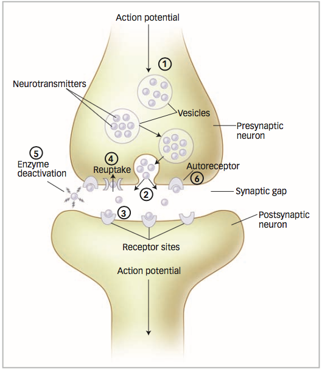
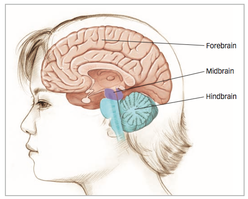
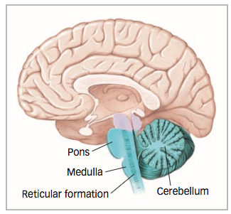
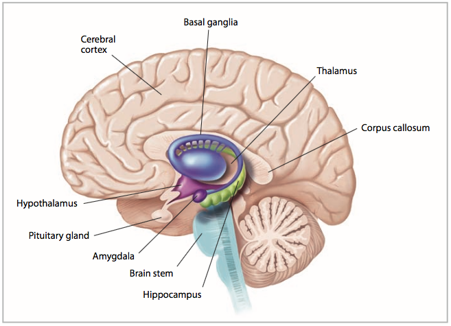
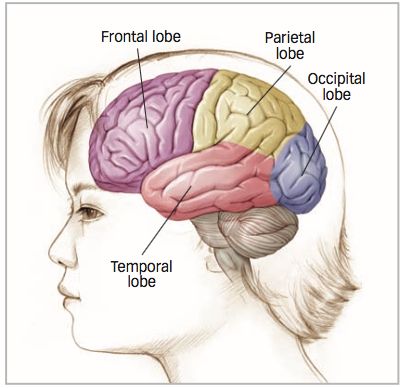

# Chapter 3 Notes

### Neurons: The Origin of Behavior

100 billion neurons in your brain

**Neurons**: cells in the nervous system that communicate with one another to perform information-processing tasks
  - have cell body (soma), largest component of the neuron that coordinates the information-processing tasks and keeps the cell alive
    - contains nucleus: houses chromosomes that contain your DNA

Have two speciailized extensions of the cell membrane:
  - **Dendrites** receive information from other neurons and relay it to the cell body (have many)
  - **axon** transmits information to other neurons, muscles, or glands (have one)

**myelin sheath**, an insulating layer of fatty material covering the axon

myelin sheath is composed of **glial cells**, which are support cells found in the nervous system
  - digest parts of dead neurons
  - provide physcial/nutritional support for neurons
  - form myelin

**demyelinating diseases**, such as multiple sclerosis, the myelin sheath deteriorates, slowing the transmission of information from one neuron to another
  - loss of feeling in the limbs, partial blindness, and difficulties in coordinated movement and cognition

**synapse**: the junction or region between the axon of one neuron and the dendrites or cell body of another

100-500 trillion synapses

Three major types of neurons:
  - **Sensory**: receive information from the external world and convey this information to the brain via the spinal cord.
    - have specialized endings on their dendrites that receive signals for light, sound, touch, taste, and smell
  - **Motor**: carry signals from the spinal cord to the muscles to produce movement
    - have long axons that can stretch to muscles at our extremities
  - **interneurons**, which connect sensory neurons, motor neurons, or other interneurons

### Information Processing in Neurons

First, information has to travel inside the neuron—from the dendrite, to the cell body, to the axons. This information takes the form of an electrical signal that travels across the neuron. Then the signal has to be passed from one neuron, across the synapse, to another neuron

Neuron's cell membrane is porous, which allows ions to flow in and out of the cell

**resting potential** The difference in electric charge between the inside and outside of a neuron’s cell membrane.
  - potassium (K+) ions inside the neuron’s cell membrane
  - sodium (Na+) is kept out

**action potential** An electric signal that is conducted along a neruon’s axon to a synapse.
  - only when shock reaches certain threshold
  - all or nothing

myelin sheath, which is made up of glial cells that coat and insulate the axon, facilitates the transmission of the action potential down the length of the axon.
  - **nodes of ranvier**: breakpoints between clumps of myelin

**refractory period** The time following an action potential during which a new action potential cannot be initiated.

**terminal buttons** Knoblike structures that branch out from an axon.

**neurotransmitters** Chemicals that trans- mit information across the synapse to a receiving neuron’s dendrites.

**receptors** Parts of the cell membrane that receive the neurotransmitter and initiate or prevent a new electric signal.

sending neuron, or presynaptic neuron

receiving neuron, or postsynaptic neuron

Neurotransmitters leave the synapse through three processes:
  1. First, neurotransmitters can be reabsorbed by the terminal buttons of the presynaptic neuron, a process called reuptake.
  2. Second, neurotransmitters can be broken down into their component molecules, a process called deactivation.
  3. Third, neurotransmitters can bind to receptor sites called autoreceptors on the presynaptic neuron

#### Types and Functions of Neurotransmitters

**Acetylcholine (ACh)** is a neurotransmitter involved in a number of functions, including voluntary motor control. Acetylcholine is found in neurons of the brain and in the synapses where axons connect to muscles and body organs, such as the heart. Acetylcholine also contributes to the regulation of attention, learning, sleeping, dreaming, and memory (Gais & Born, 2004; Hasselmo, 2006; Wrenn et al., 2006). Alzheimer’s disease, a medical condition involving severe memory impairments (Salmon & Bondi, 2009), is associated with the deterioration of ACh-producing neurons.

**Dopamine** is a neurotransmitter that regulates motor behavior, motivation, plea- sure, and emotional arousal. Because of its association with the processing of motivation and pleasure, dopamine plays a role in drug addiction (Baler & Volkow, 2006). High levels of dopamine have been linked to schizophrenia (Winterer & Weinberger, 2004), while low levels have been linked to Parkinson’s disease.

**Glutamate** is a major excitatory neurotransmitter in the brain, meaning that it enhances the transmission of information between neurons. **GABA** (gamma- aminobutyric acid), in contrast, is the primary inhibitory neurotransmitter in the brain, meaning that it tends to stop the firing of neurons. Too much glutamate, or too little GABA, can cause neurons to become overactive, causing seizures.

Two related neurotransmitters, **norepinephrine** and **serotonin**, influence mood and arousal. Norepinephrine is particularly involved in vigilance, or a heightened awareness of dangers in the environment (Ressler & Nemeroff, 1999). Serotonin is involved in the regulation of sleep and wakefulness, eating, and aggressive behavior (Dayan & Huys, 2009; Kroeze & Roth, 1998). Because both neurotrans- mitters affect mood and arousal, low levels of each have been implicated in mood disorders (Tamminga et al., 2002).

Endorphins are chemicals that act within the pain pathways and emotion centers of create the feeling of the brain to help dull the experience of pain and elevate moods (Keefe et al., 2001). The “runner’s high” experienced by many athletes as they push their bodies to painful limits of endurance can be explained by the release of endorphins in the brain (Boecker et al., 2008).

#### How Drugs Mimic Neurotransmitters

**Agonists** are drugs that increase the action of a neurotransmitter.

**Antagonists** are drugs that block the function of a neurotransmitter.

### The Organization of the Nervous System

**nervous system** is an interacting network of neurons that conveys electrochemical information throughout the body.

**central nervous system (CNS)** is composed of the brain and spinal cord

**peripheral nervous system (PNS)** connects the central nervous system to the body’s organs and muscles

#### Peripheral Nervous System

**somatic nervous system** A set of nerves that conveys information into and out of the central nervous system.

**autonomic nervous system (ANS)** A set of nerves that carries involuntary and automatic commands that control blood vessels, body organs, and glands.
  - has two major subdivisions, the sym- pathetic nervous system and the parasympathetic nervous system

**sympathetic nervous system** is a set of nerves that prepares the body for action in threatening situations

**parasympathetic nervous system** helps the body return to a normal resting state

#### Central Nervous System

**spinal reflexes**, simple pathways in the nervous system that rapidly generate muscle contractions

### Structure of the Brain

#### The Hindbrain

the spinal cord is continuous with the **hindbrain**, an area of the brain that coordinates information coming into and out of the spinal cord

controls the most basic functions of life: respiration, alertness, and motor skills

There are three anatomical structures that make up the hindbrain: the medulla, the cerebellum, and the pons

**medulla** is an extension of the spinal cord into the skull that coordinates heart rate, circulation, and respiration

Inside the medulla is a small cluster of neurons called the **reticular formation**, which regulates sleep, wakefulness, and levels of arousal.

**cerebellum**, a large structure of the hindbrain that controls fine motor skills

**pons**, a structure that relays information from the cerebellum to the rest of the brain

#### The Midbrain

midbrain contains two main structures: the **tectum** and the **tegmentum**. These structures help orient an organism in the environment and guide movement toward or away from stimuli.

#### The Forebrain

The forebrain is the highest level of the brain— literally and figuratively—and controls complex cognitive, emotional, sensory, and motor functions

##### Subcortical Structures

_areas of the forebrain housed under the cerebral cortex near the very center of the brain_

**thalamus** relays and filters information from the senses and transmits the information to the cerebral cortex
  - actively  lters sensory information, giving more weight to some inputs and less weight to others

**hypothalamus** regulates body temperature, hunger, thirst, and sexual behavior

**pituitary gland**, the “master gland” of the body’s hormone-producing system, which releases hormones that direct the functions of many other glands in the body

**hippocampus** is critical for creating new memories and integrating them into a network of knowledge so that they can be stored inde nitely in other parts of the cerebral cortex

**amygdala** plays a central role in many emotional processes, particularly the formation of emotional memories
  - Located at the tip of each horn of the hippocampus is the amygdala

**basal ganglia**, a set of subcortical structures that directs intentional movements
  - striatum, is involved in the control of posture and movement

##### The Cerebral Cortex

_the outermost layer of the brain, visible to the naked eye, and divided into two hemispheres_

The cerebral cortex occupies roughly the area of a newspaper page

**occipital lobe** A region of the cerebral cor- tex that processes visual information.

**parietal lobe** A region of the cerebral cor- tex whose functions include processing information about touch.

**temporal lobe** A region of the cerebral cor- tex responsible for hearing and language.

The functions of the cerebral cortex can be understood at three levels:

1: Organization Across Hemispheres: each hemisphere controls the functions of the opposite side of the body (contralateral control)
  - **corpus callosum** A thick band of nerve fibers that connects large areas of the cerebral cortex on each side of the brain and supports communication of informa- tion across the hemispheres.

2: Organization Within Hemispheres
  - Each hemisphere of the cerebral cortex is divided into four areas, or lobes: From back to front, these are the occipital lobe, the parietal lobe, the temporal lobe, and the frontal lobe
  -  **occipital lobe**, located at the back of the cerebral cortex, processes visual information
  - **parietal lobe**, located in front of the occipital lobe, carries out functions that include processing information about touch. The parietal lobe contains the _somatosensory cortex_, a strip of brain tissue running from the top of the brain down to the sides
  - **temporal lobe**, located on the lower side of each hemisphere, is responsible for heading and language. The _primary auditory cortex_ in the temporal lobe is analogous to the somatosensory cortex in the pariteal lobe
  - **frontal lobe**, which sits behind the forehead, has specialized areas for movement, abstract thinking, planning, memory, and judgment

3: Organization Within Specific Lobes

There is a hierarchy of processing stages from primary areas that handle fine details of information all the way up to **association areas**, which are composed of neurons that help provide sense and meaning to information registered in the cortex

#### Evolution of Nervous System

**gene** is the unit of hereditary transmission

**chromosomes**, which are strands of DNA wound around each other in a double-helix configuration

The probability of sharing genes is called **degree of relatedness**

**monozygotic twins** (also called identical twins), who develop from the splitting of a single fertilized egg and therefore share 100% of their genes

**Dizygotic twins** (fraternal twins) develop from two separate fertilized eggs and share 50% of their genes, the same as any two siblings born separately

### Investigating the Brain

Study the brain by using three techniques: testing people with brain damage and observing their deficits, studying electrical activity in the brain during behavior, and conducting brain scans while people perform various tasks.

#### Studying Damaged Brain

Phineous Cage

In a split-brain patient, information entering one hemisphere stays there

#### Listening to the Brain: Single Neurons and Global Activity

**electroencephalograph (EEG)** is a device used to record electrical activity in the brain

#### Brain Imaging

_Structural brain imaging_ provides information about the basic structure of the brain and allows clinicians or researchers to see abnormalities in brain structure.

_Functional brain imaging_, in contrast, provides information about the activity of the brain when people perform various kinds of cognitive or motor tasks.

_Computerized axial tomography (CT)_ scan: a CT scan, a scanner rotates a device around a person’s head and takes a series of x-ray photographs from different angles. Computer programs then combine these images to provide views from any angle. CT scans show different densities of tissue in the brain

_magnetic resonance imaging (MRI)_, involves applying brief but powerful magnetic pulses to the head and recording how these pulses are absorbed throughout the brain

_positron emission tomography (PET)_, a harmless radioactive substance is injected into a person’s bloodstream. Then the brain is scanned by radiation detectors as the person performs perceptual or cognitive tasks, such as reading or speaking. Areas of the brain that are activated during these tasks demand more energy and greater blood flow, resulting in a higher amount of radioactivity in that region

_functional magnetic resonance imaging_ (fMRI), magnetic pulses cause the twisting of hemoglobin molecules. Hemoglobin is the mol- ecule in the blood that carries oxygen to our tissues, including the brain
