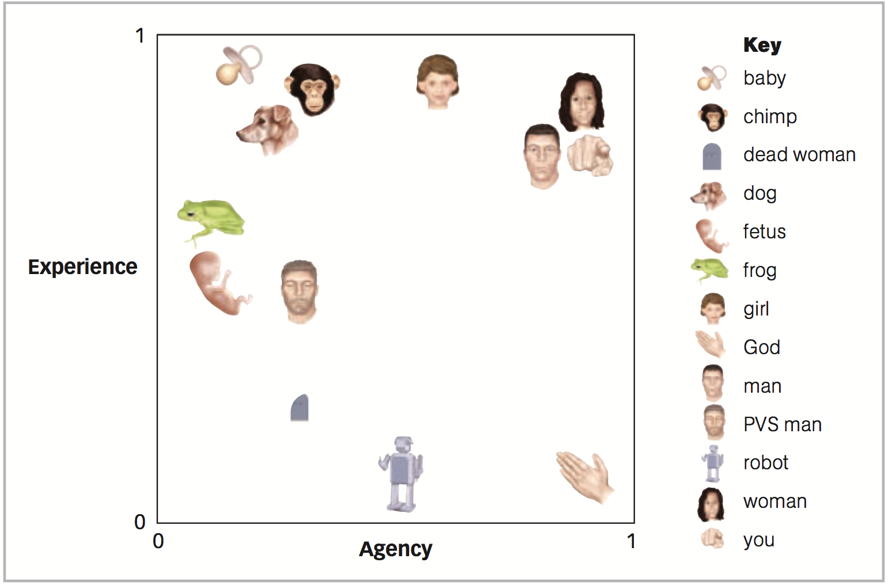
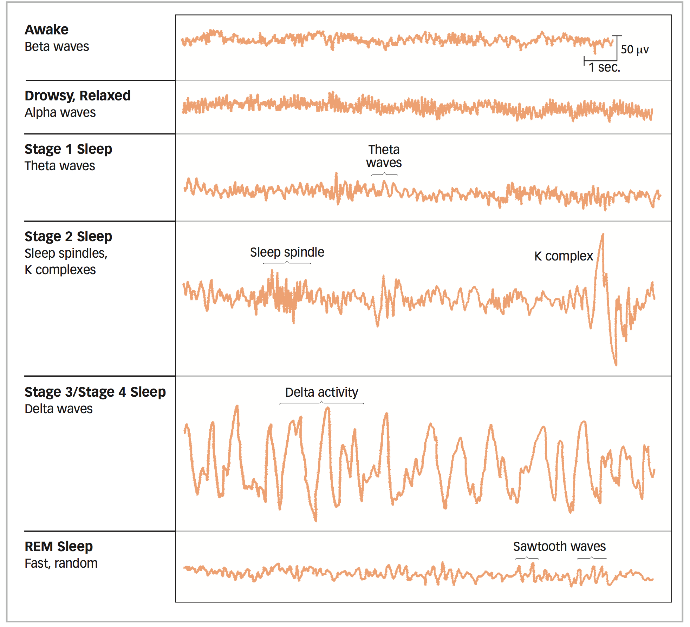

# Chapter 5 Notes: Consciousness

**Consciousness** is a person’s subjective experience of the world and the mind

**Phenomenology**: how things seem to the conscious person

### Consciousness and Unconsciousness

##### The Problem of Other Minds

**problem of other minds**, the fundamental difficulty we have in perceiving the consciousness of others

We simply lack the ability to directly perceive the consciousness of others

##### The Mind/Body Problem

**mind/body problem**, the issue of how the mind is related to the brain and body

“the mind is what the brain does”

The feeling that you are consciously willing your actions, it seems, may be a result rather than a cause of your brain activity. Although your personal intuition is that you think of an action and then do it, these experiments suggest that your brain is getting started before either the thinking or the doing, preparing the way for both thought and action. Quite simply, it may appear to us that our minds are leading our brains and bodies, but the order of events may be the other way around

#### The Nature of Consciousness

Researchers have described four basic properties of consciousness:

1. Intentionality, which is the quality of being directed toward an object
2. unity, or resistance to division
3. selectivity, the capacity to include some objects but not others (**cocktail party phenomenon**, people tune in one message even while they filter out others nearby)
4. transience, or the tendency to change (stream of consciousness partly reflects the limited capacity of the conscious mind)

##### Levels of Consciousness

**Minimal consciousness** is consciousness that occurs when the mind inputs sensations and may output behavior
  - possibly level of consciousness plants and animals experience

**Full consciousness** is the level of awareness in which you know and are able to report your mental state
  - Full consciousness involves not only thinking about things but also thinking about the fact that you are thinking about things

**Self-consciousness** is the level of consciousness in which the person’s attention is drawn to the self as an object

##### Conscious Contents

**mental control,** the attempt to change conscious states of mind

**thought suppression**, the conscious avoidance of a thought

**rebound effect of thought suppression**, the tendency of a thought to return to consciousness with greater frequency following suppression

**ironic processes of mental control** proposes that such ironic errors occur because the mental process that monitors errors can itself produce them

#### The Unconscious Mind

##### Freudian Unconscious

**dynamic unconscious**—an active system encompassing a lifetime of hidden memories, the person’s deepest instincts and desires, and the person’s inner struggle to control these forces

**repression**, a mental process that removes unacceptable thoughts and memories from consciousness and keeps them in the unconscious

Freud looked for evidence of the unconscious mind in speech errors and lapses of consciousness, or what are commonly called “Freudian slips.”

##### A Modern View on Cognitive Unconscious

the current study of the unconscious mind views it as the factory that builds the products of conscious thought and behavior

**cognitive unconscious** includes all the mental processes that are not expe- rienced by a person but that give rise to the person’s thoughts, choices, emo- tions, and behavior.

**subliminal perception**, when thought or behavior is influenced by stimuli that a person cannot consciously report per- ceiving

### Sleep and Dreaming: Good Night, Mind

**altered state of consciousness**—a form of experience that departs significantly from the normal subjective experience of the world and the mind

#### Sleep

**Circadian rhythym**: naturally occurring 24-hour cycle—from the Latin circa, “about,” and dies, “day.”

We’re 25.1-hour people liv- ing in a 24-hour world.

the largest changes in EEG occur during sleep. These changes show a regular pattern over the course of the night that includes five sleep stages:

**insomnia** Difficulty in falling asleep or staying asleep.

**sleep apnea** A disorder in which the per- son stops breathing for brief periods while asleep.

**somnambulism** (sleepwalking) Occurs when the person arises and walks around while asleep.

**narcolepsy** A disorder in which sudden sleep attacks occur in the middle of waking activities.

#### Dreams

There are five major characteristics of distinguish it from the waking state:

- intensely feel emotion, whether it is bliss or terror or love or awe.
- Dream thought is illogical
- Sensation is fully formed and meaningful; visual sensation is predominant, and you may also deeply experience sound, touch, and movement
- Dreaming occurs with uncritical acceptance, as though the images and events were perfectly normal rather than bizarre
- We have difficulty remembering the dream after it is over

##### Dream Theories

There is evidence that they do feature the return of suppressed thoughts

Dreams harbor unwanted thoughts

**activation-synthesis model**: This theory proposes that dreams are produced when the mind attempts to make sense of random neural activity that occurs in the brain during sleep

### Drugs and Consciousness: Artificial Inspiration

**Psychoactive drugs** are chemicals that influence consciousness or behavior by altering the brain's chemical message system
  - They exert their influence by increasing the activity of a neurotransmitter (the agonists) or decreasing its activity (antagonist)

**Depressants** are substances that reduce the activity of the central nervous system

Alcohol is a GABA agonist

**Expectancy theory** suggests that alcohol effects are produced by people’s expecta- tions of how alcohol will influence them in particular situations

**alcohol myopia**, which proposes that alcohol hampers attention, leading people to respond in simple ways to complex situations

**stimulants** are substances that excite the central nervous system, heightening arousal and activity levels

**Hypnosis** is an altered state of consciousness characterized by suggestibility and the feeling that one’s actions are occurring involuntarily.

Not possible to recover lost memories when hypnotized, but rather the participants make them up

**hypnotic analgesia**, the reduction of pain through hypnosis in people who are hypnotically susceptible

### Meditation and Religious Experiences: Higher Consciousness
