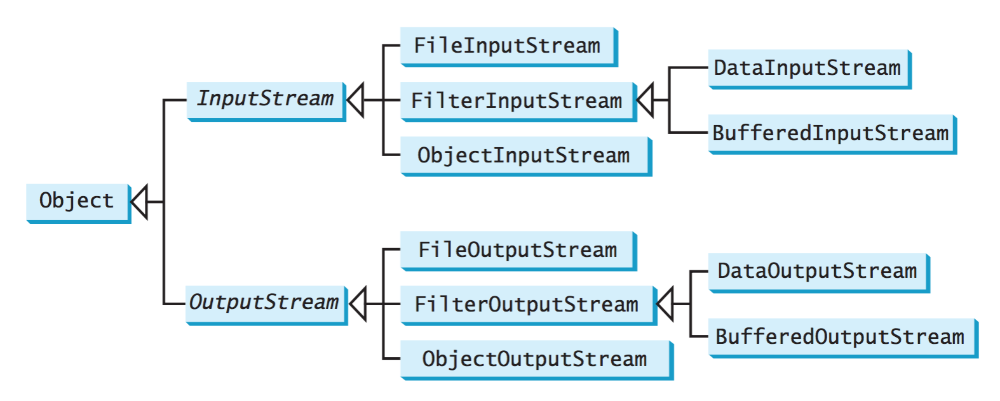

# Java Notes

## [Introduction to Java Programming [Comprehensive Version]](http://www.amazon.com/Intro-Java-Programming-Comprehensive-Version/dp/0133761312)

### Chapter 1

* .java -> compiles to .class that's then executed by JVM
* Float 32-bit IEEE 754, double 64-bit IEEE 754
* Source file with extension .java should have same exact name as the public class name
* When executing a Java program, the JVM first loads the bytecode of the class to mem-ory using a program called the *class loader*. If your program uses other classes, the class loader dynamically loads them just before they are needed. After a class is loaded, the JVM uses a program called the *bytecode verifier* to check the validity of the bytecode and to ensure that the bytecode does not violate Java’s security restrictions
* `/**` denotes a javadoc comment


### Chapter 2

* Naming conventions: ClassName, methodName(), variableName, CONSTANT_NAME
* Floating point literals: By default, are considered double values (e.g. 5.0). Append letter `f` of `F` to make float.
* Java expressions are evaluated in the same way as arithmetic expressions
* Avoid round off errors by using integers whenever a precise result is required
* Avoid unintended integer division by making sure one of the operands is a floating point number


### Chapter 3

* Avoid equality test of two floating point values


### Chapter 6

* The arguments are passed by value to parameters when invoking a method


### Chapter 9

* Final data members must be initialized
* All objects inherit from Object class
  * `public String toSring()`
  * `public boolean equals()`
  * `public Class<?> getClass()` - returns reference of class object
  * `public int hashcode()`
* Only one public class / file, compiles to multiple .class files
* Data field default values:
  * Reference: null (literal for reference types, related to true/false in that they are boolean literals)
  * Numeric: 0
  * boolean: false
  * char: `\u0000`
* package-private is the default visibility modifier
* Although Java passes by value, passing a reference variable actually passes a reference of the object (as that's what the variable contains, duuh)
* Immutable class contains all private data fields, and no public setters
* `this` refers to the object itself. It's often used to reference hidden data fields (e.g. `this.i = i`), and to invoke another constructor w/in the class


### Chapter 10

* BigInteger and BigDecimal classes can be used to represent integers/decimals of any size/precision
  * Both are immutable

* *interned string*: Because strings are immutable and are ubiquitous in programming, the JVM uses a unique instance for string literals with the same character sequence in order to improve efficiency and save memory

  ```java
  String s1 = "Welcome to Java";
  String s2 = new String("Welcome to Java");
  String s3 = "Welcome to Java";

  s1 == s2 is false
  s1 == s3 is true
  ```

* The StringBuilder and StringBuffer classes are similar to the String class except that the String class is immutable


### Chapter 11

* Java enforces *single inheritance*, a Java class can only inherit directly from one superclass
* Constructing an instance of a class invokes the constructors of all the superclasses along the inheritance chain
  * Subclass constructor invokes its parent class constructor before performing its own tasks, this follows up and up superclasses (Constructor Chaining)
* Use `super.methodName()` to call superclasses' methods
* Overriding: method must be defined in the subclass using the same sig- nature and the same return type as in its superclass
* Overloading: to define multiple methods with the same name but different signatures
* Every class in Java is descended from the java.lang.Object class
  * `public String toString()`: returns, by default, ClassName@memAddrInHex
  * `public boolean equals(Object o)`
    * override the default `return (this == o)` to check whether the two distinct objects have the same content
* *Polymorphism*: variable of a supertype can refer to a subtype object
* *Dynamic Binding*: A method can be implemented in several classes along the inheritance chain. The JVM decides which method is invoked at runtime
  * e.g. `Object o = new GeometricObject()`
    * declared type: Object
    * actual type: GeometricObject
  * Dynamic binding works by searching for a method p from the most specific class (actual) to the most general (Object)
* `Object o = new Student()` -> implicit casting
* `Student j = (Student) new Object` -> explicit casting
  * Good practice to use `instanceof` operator before explicit casting
* Protected member of a class can be accessed from a subclass
  * subclass can override a protected method defined in its superclass and change its visibility to public. However, a subclass cannot weaken the accessibility of a method defined in the superclass
* Neither a final class nor a final method can be extended. A final data field is a constant
* The modifiers public, protected, private, static, abstract, and final are used on classes and class members (data and methods), except that the final modifier can also be used on local variables in a method. A final local variable is a constant inside a method
* A static method cannot be overridden. If a static method defined in the superclass is redefined in a subclass, the method defined in the superclass is hidden. The hidden static methods can be invoked using the syntax SuperClassName.staticMethodName
* Always reference static variables and methods from a class name (as opposed to a reference variable) to avoid errors and improve readability
* Don't pass a parameter from a constructor to initialize a static data field - it's better to use a setter method to change static data


### Chapter 12

* Best practice to make custom exceptions checked
* The order in which exceptions are specified in a catch block is important. A compile error will result if you specify an exception object of a class after an exception object of the superclass of that class
* Try-with-resources automatically closes files
  ```java
    try (declare and create resources) { Use the resource to process the file;
  }
  ```
* *token-reading* methods (e.g. nextByte(), nextInt(), etc) work by first skipping any delimiters then reads a token ending at a delimiter. The token is then converted into a value of the corresponding method call (i.e. int for nextInt())


### Chapter 13

* A superclass defines common behavior for related subclasses. An interface can be used to define common behavior for classes (including unrelated classes)

##### Abstract Classes

* An abstract class cannot be used to create objects. An abstract class can contain abstract methods, which are implemented in concrete subclasses
  * e.g. `public abstract class ClassName` and `public abstract double getArea()`
* The constructor in the abstract class is defined as protected, because it is used and invoked only by subclasses
* A class that contains abstract methods must be abstract. However, it is possible to define an abstract class that doesn’t contain any abstract methods. In this case, you cannot create instances of the class using the new operator. This class is used as a base class for defining subclasses
* A subclass can override a method from its superclass to define it as abstract
* You cannot create an instance from an abstract class using the new operator, but an abstract class can be used as a data type
  * e.g. `AbsClassName[] objects = new AbsClassName[10];`

##### Interfaces

```java
public interface Edible {
/** Describe how to eat */
public abstract String howToEat();
}
```

* Classes can implement interface with `implements` keyword
* Since all data fields are `public static final` and all methods are `public abstract` in an interface, Java allows these modifiers to be omitted
* Comparable interface defines the `compareTo` method for comparing objects
  ```java
  public class Integer extends Number implements Comparable<Integer> {
    // class body omitted
    @Override
    public int compareTo(Integer o) {
        // Implementation omitted
    }
  }
  ```

* Cloneable interface specifies that an object can be cloned
  * has an empty body (*marker interface*): simply denotes that a class possesses certain desirable properties
  * cloned with `clone()` method defined in Object class
  * `clone()` copies each field from original to target object
    * primitive field's values are copied
    * reference field's references are copied (shallow copy, as opposed to deep copy)
  * To define custom class that's 'Cloneable', must override the `clone()` method in the Object class
    * ```java
    public Object clone() throws CloneNotSupportedException {
      return super.clone();
    }
    ```
      * Note this changes the Object class' `clone()` method's visibility to public

* `native` keyword (e.g. `protected native Object clone() throws CloneNotSupportedException;
`) indicates that the method is not written in Java but is implemented in the JVM for the native platform


##### Abstract vs. Interface

* Abstract
  * Class can only extend one abstract class
  * Can have both abstract and concrete methods
  * `abstract` keyword is mandatory to declare a method abstract

*  Interface
  * Can extend any number of interfaces at a time
  * Interface can only extend from an interface
  * Can only have `public abstract` instance methods
  * Can only have `public static final` variables
  * No constructor
  * `abstract` keyword is optional to declare a method abstract

### Chapter 14: JavaFX Basics

* Swing and AWT are replaced by the JavaFX platform for developing rich Internet applications
* The abstract `javafx.application.Application` class defines the essential framework for writing JavaFX programs
* Designed with theatre analogy - has stages, scenes, and nodes (actors)
* Panes automatically lay out the nodes in a desired location and size
* `StackPane` places nodes in the center of the pane on top of e/o
* Java coordinate system's origin is at the upper left corner
  * Y axis increases downwards
* *Property binding* binds a target object (binding object) to a source object (bindable object). A change in the source object will be automatically reflected in the target
  * Target binds to a source with `target.bind(source)`
* Common properties and methods for Nodes include:
  * Style properties called JavaFX CSS (defined with prefix `-fx-`)
    * e.g. `circle.setStyle("-fx-stroke: black; -fx-fill: red;");`
* `javafx.scene.image.ImageView` is a node for displaying an image
  * `ImageView imageView = new ImageView("image/us.gif")`
* JavaFX provides many types of panes for automatically laying out nodes in a desired location and size
  * StackPane: Places the nodes on top of each other in the center of the pane.
  * FlowPane: Places the nodes row-by-row horizontally or column-by-column vertically.
  * GridPane: Places the nodes in the cells in a two-dimensional grid.
  * BorderPane: Places the nodes in the top, right, bottom, left, and center regions.
  * HBox: Places the nodes in a single row.
  * VBox: Places the nodes in a single column.


### Chapter 15: Event-Driven Programming and Animations

* Buttons are *event source objects*-where the action originates
* Event handler processes the event fired from the source object
  * To be a handler of an action event:
    * must be instance of `EventHandler<T extends Event>` interface
    * EventHandler object handler must be registered with the event source object using the method `source.setOnAction(handler)`


* An event is an object created from an event source. Firing an event means to create an event and delegate the handler to handle the event
* The root class of the Java event classes is `java.util.EventObject`
* The root class of the JavaFX event classes is `javafx.event.Event`
  * EventObject <- Event <- ActionEvent, InputEvent, WindowEvent
* Other event registration methods like:
  * `setOnMousePressed(EventHandler<MouseEvent>)`
  * `setOnKeyTyped(EventHandler<KeyEvent>)`
* A handler is an object that must be registered with an event source object, and it must be an instance of an appropriate event-handling interface


* An inner class, or nested class, is a class defined within the scope of another class. Inner classes are useful for defining handler classes
* Normally define inner class if it is used only by its outer class
* Features:
  * An inner class is compiled into a class named `OuterClassName$InnerClassName. class`
  * An inner class can reference the data and the methods defined in the outer class in which it nests, so you need not pass the reference of an object of the outer class to the constructor of the inner class
  * An inner class can be defined with a visibility modifier subject to the same visibility rules applied to a member of the class
  * An inner class can be defined as static. A static inner class can be accessed using the outer class name. A static inner class cannot access nonstatic members of the outer class
  * To create an object of the inner class from another class:
    * `OuterClass.InnerClass innerObject = outerObject.new InnerClass();`
    * If static: `OuterClass.InnerClass innerObject = new OuterClass.InnerClass();`


#### 15.5: Anonymous Inner Classes

*An anonymous inner class is an inner class without a name. It combines defining an inner class and creating an instance of the class into one step*

```java
new SuperClassName/InterfaceName() {
// Implement or override methods in superclass or interface
    // Other methods if necessary
}
```
* Like inner class with following unique features:
  * An anonymous inner class must always extend a superclass or implement an inter- face, but it cannot have an explicit extends or implements clause
  * An anonymous inner class always uses the no-arg constructor from its superclass to create an instance
  * An anonymous inner class is compiled into a class named `OuterClassName$n. class` (e.g. `Test$1.class`)

#### 15.6: Lambda Expressions

*Lambda expressions can be used to greatly simplify coding for event handling*

* New in Java 8, essentially anonymous class with concise syntax
* Syntax:
  * `(type1 param1, type2 param2, ...) -> expression`
  * `(type1 param1, type2 param2, ...) -> { statements; }`
* Compiler understands that the object must be an instance of the stated parameter
  * Interface must only contain one abstract method (*functional interface*)


#### 15.10: Listeners for Observable Objects

*You can add a listener to process a value change in an observable object*

* Instance of `Observable` is called an observable object
  * contains method `addListener(InvalidationListener listener)`

  ### Chapter 17: Binary I/O

  * Files can be classified as either text or binary - everything that can't be processed by a text editor is binary
  * Binary I/O does not involve encoding or decoding and thus is more efficient than text I/O
  * Text I/O is built upon binary I/O to provide a level of abstraction for character encoding and decoding


#### 17.4: Binary I/O Classes



* `InputStream` is the root for binary input classes, `OutputStream` for output classes
* `FileInputStream/FileOutputStream` is for reading/writing bytes from/to files. All the methods in these classes are inherited from `InputStream` and `OutputStream`
* *Filter streams* are streams that filter bytes for some purpose like reading integers, doubles, etc
  * *FilterInputStream* and *FilterOutputStream* are the base classes for filtering data
* *DataInputStream* reads bytes from the stream (`FileInputStream`) and converts them into appropriate primitive-type values or strings
* UTF-8 is a coding scheme that allows systems to operate with both ASCII and Unicode
* Most operating systems use ASCII. Java uses Unicode. The ASCII character set is a subset of the Unicode character set
* Catch `EOFException` to detect end of file


* `BufferedInputStream`/`BufferedOutputStream` can be used to speed up input and output by reducing the number of disk reads and writes
  * Works by reading/writing the whole block of data into buffer in memory at once
  * You can wrap a `BufferedInputStream`/`BufferedOutputStream` on any `InputStream`/`OutputStream` with the following constructor: `BufferedInputStream(in: InputStream)`
    ```java
    DataOutputStream output = new DataOutputStream(
      new BufferedOutputStream(new FileOutputStream("temp.dat")));
    ```
  * Should only use with files >100mb


#### 17.6: Object I/O

*`ObjectInputStream`/`ObjectOutputStream` classes can be used to read/write serializable objects*

* Perform I/O for objects in addition to primitives and strings
  * Can completely replace DataIOStream equivalents
* `output.writeObject(new java.util.Date());`
* `java.util.Date date = (java.util.Date)(input.readObject());`
* You have to read the data from the file in the same order and format as they were written to the file
* An object must be *serializable* to be written to an output stream
* When a serializable object is stored, the class of the object is encoded; this includes the class name and the signature of the class, the values of the object’s instance variables, and the closure of any other objects referenced by the object. The values of the object’s static variables are not stored
* If serialized object contains fields that aren't serializable, mark them as `transient` to tell the JVM to ignore them when writing to an output stream
  * `private transient A v3 = new A();`
* All objects only stored once


#### 17.7: Random-Access Files

*Java provides the `RandomAccessFile` class to allow data to be read from and written to at any locations in the file*

* All previous streams were read-only or write-only, or sequential streams. Files open in sequential streams cannot be modified, thus the case for RandomAccessFile
* Allows files to be opened in `r` and `rw` modes
* A file pointer marks increments as you read/write data to the file (sequence of bytes). Use `seek(int)` method to move file pointer to a specified location


### Spring

* Spring wires the classes up with a XML file, so that all of the objects are instantiated and initialized by Spring and injected in the right places (Servlets, Web Frameworks, Business classes, DAOs, etc, etc, etc...)

* *Inversion of Control*: The application controls the framework, not vice-versa
